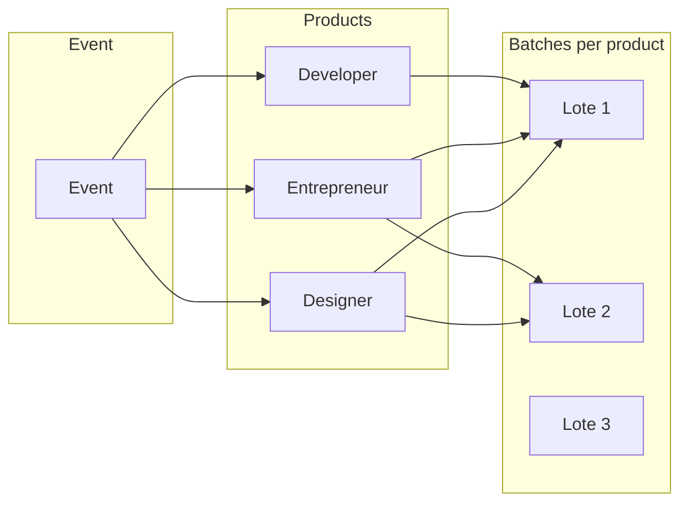

# ADR 02: Ticket Batches for Products

## Status

Proposed.

## Context

Products (ticket types) are currently represented by the repeatable component `payment_option` on Event: each entry has a single price and no notion of numbered batches or time-bound validity. This ADR describes the decision to introduce a Product and Batch model so each ticket type can have multiple batches (e.g. Lote 1, 2, 3) with distinct price, optional quantity, and optional validity window. Scope: eventando-manager only.

## Current state

- **Products** are represented by the repeatable component `payment_option` on [Event](src/api/event/content-types/event/schema.json): each entry has `name`, `value` (price in cents), `enabled`, `can_be_listed`. There is no separate Product entity and no notion of batches.
- **Signup** ([signup controller](src/api/signup/controllers/signup.js)) receives `payment_option` (component instance id), finds that option in the event's `payment_option` array, and uses its `value` for payment. There is no stock/quantity check.
- **Sale** has `payment_option_id` (integer) linking to one of the event's payment options.

## Target model

- **Product** = ticket type (e.g. Designer, Entrepreneur, Developer): has a name and belongs to an event.
- **Batch** = numbered lot per product (1, 2, 3, …): has `batch_number`, `value` (price), optional `max_quantity`, and belongs to a product.

Relationship: **Event** → **Products** (oneToMany) → **Batches** (oneToMany per product). A purchasable option = one **Batch** (e.g. "Designer – Lote 2" with a specific price).

## Decision / Implementation plan

### 1. Schema: Product and Batch content types

- **Product** (new collection type)
  - `name` (string)
  - `event` (relation, manyToOne → Event)
  - `enabled` (boolean), `can_be_listed` (boolean) — same semantics as current payment_option
  - Optional: `description` (text) for future use
- **Batch** (new collection type)
  - `product` (relation, manyToOne → Product)
  - `batch_number` (integer, required) — 1, 2, 3…
  - `value` (biginteger) — price in cents
  - `max_quantity` (integer, optional) — null = unlimited
  - `enabled` (boolean, default true)
  - `valid_from` (datetime, optional) — batch is only available for signup when current time ≥ valid_from; null = no lower bound.
  - `valid_until` (datetime, optional) — batch is only available for signup when current time ≤ valid_until; null = no upper bound.
- **Event**
  - Add relation: `products` (oneToMany → Product).
  - Keep `payment_option` temporarily for backward compatibility and migration, or remove it in a follow-up after data migration (see below).
- **Payment**
  - Add optional `batch` (relation, manyToOne → Batch) so each payment is tied to a batch for reporting and stock.
- **Sale**
  - Replace `payment_option_id` (integer) with `batch` (relation, manyToOne → Batch), or add `batch` and keep `payment_option_id` during transition.
- **Signup**
  - No schema change; signup continues to reference payment. The link to batch is through Payment.batch.

Use Strapi content-type builder (or create the schema JSON files under `src/api/product` and `src/api/batch`) and run a migration to create the tables (or rely on Strapi's schema sync if applicable).

### 2. Data migration (existing events)

- For each existing Event, for each entry in `payment_option`:
  - Create a **Product** with same `name`, `enabled`, `can_be_listed`, linked to that event.
  - Create one **Batch** for that product with `batch_number: 1`, `value` = option's `value`, `max_quantity: null`, `enabled: true`.
- Existing **Sale** rows: map `payment_option_id` to the corresponding Batch (same event + component id → product → batch 1). If you keep `payment_option_id` for a while, you can resolve "option id" to batch in code until all consumers use `batch_id`.
- **Payments** already created: leave `batch` null or backfill by matching event + value + time window to a batch if needed for reporting.

### 3. Signup flow (select batch, enforce stock)

- **Public API**: Accept `batch_id` (Batch document id) instead of (or in addition to) `payment_option` for new flows.
  - Load Batch with `product` and `product.event` populated.
  - Validate: batch exists, batch.enabled, product.enabled, product.event.id matches request event.
  - **Batch expiration (valid_from / valid_until)**: apply the business rules in section 3.1; if the batch is not within its validity window, reject signup with the appropriate message.
  - If batch has `max_quantity`: count payments for this batch with status CONFIRMED (and optionally PEDING_PAYMENT) and ensure count < max_quantity; otherwise return "Esse produto já acabou!" (or "Lote esgotado").
  - Use `batch.value` for the payment amount and set `Payment.batch = batch.id`.
- **Backward compatibility**: If you keep `payment_option` on Event during transition, support both:
  - When `batch_id` is sent: use batch flow above.
  - When `payment_option` is sent (legacy): resolve to the single batch created for that option in migration (e.g. product from payment_option id, batch_number 1), then run the same validation and payment creation.

Files to change: [signup controller](src/api/signup/controllers/signup.js) (customCreate): resolve batch (by batch_id or by legacy payment_option), validate batch/product/event, **batch validity window (3.1)**, and quantity; create payment with `batch` set and use `batch.value`.

#### 3.1 Batch expiration — business rules

Implement in the signup controller (and reuse in any purchasable-options endpoint) so that a batch is only considered valid for signup when the current server time falls within its validity window:

- **valid_from**: if set, signup is allowed only when `now >= valid_from`. If `now < valid_from`, reject with a clear message (e.g. "Lote ainda não disponível" / "Batch not yet available") and HTTP 400.
- **valid_until**: if set, signup is allowed only when `now <= valid_until`. If `now > valid_until`, reject with a clear message (e.g. "Lote esgotado" / "Batch expired" or reuse "Esse produto já acabou!") and HTTP 400.
- **Null handling**: if `valid_from` is null, no lower bound (batch is valid from the start). If `valid_until` is null, no upper bound (batch does not expire).
- **Timezone**: use a single consistent clock (e.g. server UTC or configurable timezone) when comparing `now` to `valid_from`/`valid_until`; store and compare datetimes in the same timezone or as UTC.

Any endpoint that lists "purchasable" or "available" batches (e.g. events with populated products/batches or a custom purchasable-options route) should apply the same rules so expired or not-yet-valid batches are either excluded from the list or clearly marked as unavailable.

### 4. Sale and payment_option_id

- **Sale** content type: use `batch` relation instead of `payment_option_id` for new sales. If you migrate existing sales, backfill `batch` from `payment_option_id` as in the migration step.
- Any admin or internal logic that creates/reads Sales should use `batch` (e.g. populate `event`, `batch`, `batch.product`).

### 5. API exposure (eventando-manager)

- **Events API**: Support populating products and batches. Standard Strapi populate: **GET** `events/:id?populate[products][populate][batches]=*` returns event with `products[]`, each with `batches[]` (id, batch_number, value, max_quantity, valid_from, valid_until, enabled; product has name, enabled, can_be_listed).
- **Optional custom endpoint**: `GET /events/:id/purchasable-options` returning a flat list of batches (product name, batch number, value, remaining quantity, validity) with expiration rules applied — implement only if useful within this repo.
- **Signup API**: Custom route accepts `batch_id` (Batch document id) and optionally legacy `payment_option`. Request body: `batch_id` for the new flow.

### 6. Strapi admin UX

- In the admin, Event edit screen: show linked Products (and optionally inline create). Each Product edit: list Batches (batch_number, value, max_quantity, enabled). Optionally hide or deprecate the old `payment_option` component once migration is done.

### 7. Database migrations

- Add migrations under [database/migrations](database/migrations) for: creating Product and Batch tables, adding Event.products (if not using Strapi's auto-sync), Payment.batch, Sale.batch (and optionally removing sale.payment_option_id after backfill). Run migrations before or right after deploying the new content types so the DB matches the schema.

## Summary diagram

- **Signup**: Caller sends a Batch id → Payment is created with `value = batch.value` and `payment.batch = batch`. Validate batch validity window (3.1) and, if batch has `max_quantity`, count CONFIRMED payments and block when full.
- **Sale**: links to a specific Batch (e.g. promo "Designer Lote 2").

## Suggested order of work

1. Add Product and Batch content types and Event.products, Payment.batch, Sale.batch; DB migrations.
2. Data migration: create Products and Batches from existing payment_option; backfill Sale and optionally Payment.
3. Update signup controller: accept batch_id (and optionally payment_option for legacy), validate batch/product/stock, set payment.value and payment.batch.
4. Ensure events API supports populate of products and batches (and add purchasable-options endpoint only if needed).
5. Deprecate or remove Event.payment_option and Sale.payment_option_id once all internal usage is migrated.

## Consequências

- Clear separation between "ticket type" (Product) and "numbered lot" (Batch).
- Reporting and stock control via Payment.batch and Sale.batch.
- Optional per-batch quantity limits and time windows (valid_from / valid_until).
- Backward compatibility during transition via legacy `payment_option` support.
